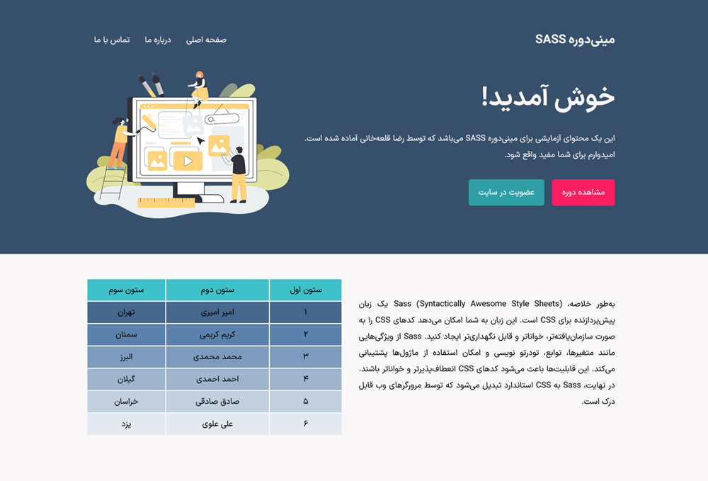

<!-- language: rtl -->

# مینی‌دوره آموزش زبان SASS | رضا قلعه‌خانی : [reza_qalekhani@](https://www.youtube.com/@reza_qalekhani)

### معرفی SASS

سرواژه SASS، مخفف Syntactically Awesome Style Sheets، یک پیش‌پردازنده CSS است که به شما اجازه می‌دهد از امکاناتی مانند متغیرها، توابع، و وراثت استفاده کنید تا کد CSS خود را سازماندهی‌شده‌تر و کارآمدتر بنویسید. علاوه بر SASS پیش‌پردازنده‌های دیگری نیز برای CSS وجود دارد که معروف‌ترین آنها  LESS و Stylus هستند.

<div style="text-align:center;">



</div>

---
### ویژگی‌های SASS

- **متغیرها (Variables)**: متغیرها به شما اجازه می‌دهند مقادیر قابل استفاده مجدد را در سراسر پروژه تعریف کنید. برای مثال، می‌توانید رنگ‌های اصلی سایت یا اندازه‌های خاصی را به عنوان متغیر ذخیره کنید.
- **تو در تویی (Nesting)**: SASS اجازه می‌دهد که کد CSS خود را به صورت تو در تو بنویسید تا ساختار کد شما مشابه ساختار HTML باشد، که این کار خوانایی و نگهداری کد را بهبود می‌بخشد.
- **ماژول‌ها (Modules)**: ماژول‌ها به شما اجازه می‌دهند کد خود را به فایل‌های کوچک‌تر تقسیم کنید و سپس آنها را در فایل اصلی خود وارد کنید.
- **توابع (Functions)**: توابع در SASS به شما امکان می‌دهند محاسبات و عملیات تکراری را انجام دهید و از نتیجه آن در کد خود استفاده کنید.
- **وراثت (Inheritance)**: وراثت به شما امکان می‌دهد خصوصیات یک کلاس را به کلاس دیگری منتقل کنید.
- **شرط‌ها (Conditionals)**: شرط‌ها به شما اجازه می‌دهند که بر اساس شرایط خاصی، کد CSS متفاوتی تولید کنید.
- **حلقه‌ها (Loops)**: حلقه‌ها در SASS به شما اجازه می‌دهند کد CSS تکراری را به صورت خودکار تولید کنید.

### فرمت فایل‌های SASS
کدهای زبان SASS داخل فایل‌هایی با فرمت `scss.` یا `sass.` ذخیره می‌شوند و بعد از کامپایل شدن، فایل‌هایی با فرمت `css.` برای شما ایجاد می‌کنند.

- در این مینی‌دوره آموزشی ما از فایل‌های `scss.` استفاده می‌کنیم که رایج‌تر هستند.

---

### متغیرها (Variables)

در SASS، می‌توانید متغیرها را با استفاده از علامت دلار (`$`) تعریف کنید. برای مثال:

```scss
$primary-color: #333;
$padding: 10px;

body {
  color: $primary-color;
  padding: $padding;
}
```

بعد از کامپایل شدن این کدها، خروجی CSS زیر تولید می‌شود:

```css
body {
  color: #333;
  padding: 10px;
}
```
---
### تو در تویی (Nesting)

تو در تویی در SASS به شما اجازه می‌دهد که به صورت تو در تو CSS بنویسید تا ساختار کد شما شبیه HTML باشد:

```scss
nav {
  ul {
    margin: 0;
    padding: 0;
    list-style: none;
  }

  li { display: inline-block; }

  a {
    display: block;
    padding: 6px 12px;
    text-decoration: none;
  }
}
```

بعد از کامپایل شدن این کدها، خروجی CSS زیر تولید می‌شود:

```css
nav ul {
  margin: 0;
  padding: 0;
  list-style: none;
}

nav li { display: inline-block; }

nav a {
  display: block;
  padding: 6px 12px;
  text-decoration: none;
}
```
---
### ماژول‌ها (Modules)

ماژول‌ها به شما کمک می‌کنند تا کد CSS خود را به فایل‌های کوچکتر تقسیم کنید و سپس آنها را وارد فایل اصلی خود کنید:

```scss
// _variables.scss
$primary-color: #333;

// main.scss
@import 'variables';

body {
  color: $primary-color;
}
```
بعد از کامپایل شدن این کدها، خروجی CSS زیر تولید می‌شود:

```css
body {
  color: #333;
}
```
---
### توابع (Functions)

توابع در SASS به شما امکان می‌دهند که عملیات پیچیده‌ای را انجام دهید و از نتایج آن در کد CSS خود استفاده کنید:

```scss
@function calculate-spacing($factor) {
  @return $factor * 8px;
}

.container {
  margin: calculate-spacing(2);
}
```
بعد از کامپایل شدن این کدها، خروجی CSS زیر تولید می‌شود:

```css
.container {
  margin: 16px;
}
```
---
### وراثت (Inheritance)

وراثت به شما امکان می‌دهد که خصوصیات یک کلاس را به کلاس دیگری منتقل کنید:

```scss
%message {
  border: 1px solid #ccc;
  padding: 10px;
  color: #333;
}

.success {
  @extend %message;
  border-color: green;
}

.error {
  @extend %message;
  border-color: red;
}
```
بعد از کامپایل شدن این کدها، خروجی CSS زیر تولید می‌شود:

```css
.success {
  border: 1px solid #ccc;
  padding: 10px;
  color: #333;
  border-color: green;
}

.error {
  border: 1px solid #ccc;
  padding: 10px;
  color: #333;
  border-color: red;
}
```
---
### شرط‌ها (Conditionals)

شرط‌ها به شما اجازه می‌دهند که بر اساس شرایط خاصی کد CSS متفاوتی تولید کنید:

```scss
$theme: dark;

body {
  @if $theme == dark {
    background: #333;
    color: #fff;
  } @else {
    background: #fff;
    color: #000;
  }
}
```
بعد از کامپایل شدن این کدها، خروجی CSS زیر تولید می‌شود:

```css
body {
  background: #333;
  color: #fff;
}
```
---
### حلقه‌ها (Loops)

حلقه‌ها در SASS به شما اجازه می‌دهند کد CSS تکراری را به صورت خودکار تولید کنید:

```scss
@for $i from 1 through 3 {
  .column-#{$i} {
    width: 100% / $i;
  }
}
```
بعد از کامپایل شدن این کدها، خروجی CSS زیر تولید می‌شود:

```css
.column-1 {
  width: 100%;
}

.column-2 {
  width: 50%;
}

.column-3 {
  width: 33.3%;
}
```
---
### نصب SASS

برای نصب SASS بر روی سیستم عامل خود می‌توانید از روش‌های مختلفی استفاده کنید که ساده‌ترین آنها روش زیر است:

> **نصب و فعال‌سازی اکستنشن Live Sass Compiler بر روی ادیتور محبوب VSCode**

همچنین می‌توانید با استفاده از ابزارهای مدیریت پکیج (package manager) نیز SASS را روی سیستم عامل خود نصب کنید:

۱- با استفاده از پکیج منیجر Node.js
```
npm install -g sass
```
۲- با استفاده از Chocolatey در سیستم عامل ویندوز
```
choco install sass
```
۳- با استفاده از Homebrew در سیستم عامل MacOS X و Linux
```
brew install sass/sass/sass
```
۴- می‌توانید سورس SASS را از گیت‌هاب پروژه دانلود کرده و آن را به `PATH` سیستم عامل خود اضافه کنید: https://github.com/sass/dart-sass

---

### بهترین تنظیمات برای اکستنشن Live Sass Compiler

```json
"liveSassCompile.settings.formats": [
    {
        "format": "expanded",
        "extensionName": ".css",
        "savePath": "/assets/css",
    },
    {
        "format": "compressed",
        "extensionName": ".min.css",
        "savePath": "/assets/css",
    }
],
"liveSassCompile.settings.generateMap": false,
"liveSassCompile.settings.autoprefix": [
    "> 1%",
    "last 2 versions",
    "Firefox ESR"
],
"liveSassCompile.settings.showOutputWindowOn": "None",
```

### منابع

جهت مطالعه بیشتر در مورد این زبان کاربردی می‌توانید به مستندات SASS به نشانی https://sass-lang.com/documentation مراجعه نمایید.

---
این آموزش توسط کانال یوتوب رضا قلعه‌خانی به نشانی https://www.youtube.com/@reza_qalekhani گردآوری شده است.
